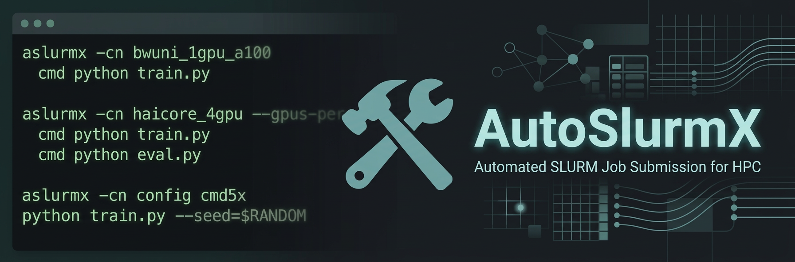

# AutoSlurmX




`AutoSlurmX` automatically generates SLURM job scripts based on reusable
Jinja2 templates and submits them for you. This includes support for multi-task
multi-GPU jobs, automatic creation of infinite chain jobs, hyperparameter
sweeps, and a Python API for programmatic job submission.

The available default templates focus on HPC clusters available at the
Karlsruhe Institute of Technology and beyond, but creating templates
for other HPC clusters is straightforward.

> **Note:** If things do not work as expected, if you have questions, or if you
> have ideas for new features, please add an issue to the repository!

## Setup

Install the repository as a pip package:

```bash
pip install git+https://github.com/aimat-lab/AutoSlurm.git
```

The command `aslurmx` will then be available to start jobs. A legacy `aslurm` command is also included.

## Job Templates

AutoSlurmX uses YAML config files that define cluster-specific SLURM settings (partition, time, memory, GPUs, etc.) and Jinja2 templates to render the actual bash scripts.

You can list all available configs with:

```bash
aslurmx config list
```

This prints a rich table showing each config's partition, time, memory, CPUs, and GRES settings.

To inspect or edit a config:

```bash
aslurmx config edit haicore_1gpu
```

To see where config files are stored:

```bash
aslurmx config where
```

Configs are loaded from two locations (higher priority first):
1. `~/.config/auto_slurm/configs/` — your custom configs
2. The `configs/` folder shipped with the package

> **Tip:** Templates for other node types and HPC clusters can easily be
> added by adapting one of the existing configs. Feel free to submit
> new job templates via pull request.

## Single-Task Jobs


<br><br>

Execute a single task on a compute node:

```bash
aslurmx -cn haicore_1gpu cmd python train.py
```

This will execute `python train.py` using a single GPU on `HAICORE`.

> **Tip:** The SLURM job files are written to `./.aslurm/` and submitted with
> `sbatch`. To only create the files without submitting (e.g. for testing), use
> the `--dry-run` / `-d` flag.

### Overwrites

You can overwrite any filler value from the config using the `-o` flag:

```bash
aslurmx -cn haicore_1gpu -o conda_env=my_env cmd python train.py
```

Multiple overwrites are comma-separated:

```bash
aslurmx -cn haicore_1gpu -o conda_env=my_env,time=01:00:00 cmd python train.py
```

To find out what fillers you can overwrite, inspect the `default_fillers` section
in the config files (`aslurmx config edit <config_name>`).

### Virtual Environment Auto-Discovery

AutoSlurmX automatically detects virtual environments (`.venv`, `venv`, `.env`, `env`, `virtualenv`) in your current working directory and activates them in the job script. You can override this with `-o venv=/path/to/venv`.

### Automatic Hostname-to-Config Mapping

If you do not specify a config with `-cn`, AutoSlurmX auto-detects the config
based on the current hostname using regex patterns defined in
`~/.config/auto_slurm/general_config.yaml`. This lets you simply run:

```bash
aslurmx cmd python train.py
```

and the correct cluster config is selected automatically.

## Multi-Task Jobs


<br><br>

Execute multiple independent scripts on a single node by supplying multiple `cmd` markers:

```bash
aslurmx -cn horeka_4gpu                    \
   cmd python train.py --config conf0.yaml \
   cmd python train.py --config conf1.yaml \
   cmd python train.py --config conf2.yaml \
   cmd python train.py --config conf3.yaml
```

All 4 tasks run in parallel, each automatically assigned one GPU.

### Command Repetition (`cmdNx`)

To run the same command multiple times, use the `cmdNx` syntax (both `cmdN` and `cmdNx` are supported):

```bash
# Run training 5 times with different random seeds
aslurmx -cn horeka_4gpu cmd5x python train.py --seed=$RANDOM
```

You can mix regular `cmd` with `cmdNx`:

```bash
# Setup once, train 3 times, evaluate once
aslurmx -cn config cmd python setup.py cmd3x python train.py cmd python eval.py
```

### GPU Assignment

By default, each task uses one GPU. Override this with `--gpus-per-task` / `-gpt`:

```bash
# Each task gets 2 GPUs
aslurmx -cn bwuni_4gpu_h100 --gpus-per-task=2 cmd python train.py cmd python train.py
```

For non-GPU jobs, use `--max-tasks` / `-mt` to control how many tasks run per job:

```bash
aslurmx -cn config --max-tasks=8 cmd python preprocess.py
```

### Forcing All Commands Into One Job

Use `--same` / `-s` to put all commands into a single job regardless of the `max-tasks` limit:

```bash
aslurmx -cn config --same cmd python task1.py cmd python task2.py cmd python task3.py
```

### Automatic Splitting Across Jobs

Each config specifies a maximum number of tasks per job (via `--max-tasks`, default: 4).
If you supply more commands than that limit, they are automatically split across multiple jobs.


<br><br>

### Sweeps

Instead of specifying all commands by hand, use the sweep shorthand syntax for
hyperparameter sweeps.

**Paired lists** `<[...]>` — values are zipped together:

```bash
aslurmx -cn horeka_4gpu cmd python train.py lr='<[1e-3,1e-4,1e-5,1e-6]>' batch_size='<[1024,512,256,128]>'
```

This creates 4 tasks:
- `python train.py lr=1e-3 batch_size=1024`
- `python train.py lr=1e-4 batch_size=512`
- `python train.py lr=1e-5 batch_size=256`
- `python train.py lr=1e-6 batch_size=128`

**Grid search** `<{...}>` — cartesian product of all values:

```bash
aslurmx -cn horeka_4gpu cmd python train.py lr='<{1e-3,1e-4,1e-5,1e-6}>' batch_size='<{1024,512,128}>'
```

This creates 12 tasks (all combinations), automatically split across 3 jobs.

> **Warning:** Don't forget the quotes `''` around sweep syntax, otherwise it
> clashes with bash syntax!

### Excluding Nodes

Exclude specific nodes from allocation:

```bash
aslurmx -cn config --exclude=node01,node02 cmd python train.py
```

## Chain Jobs

Many HPC clusters have time limits for SLURM jobs. To run tasks that take longer
than the time limit, AutoSlurmX supports the automatic creation of infinite
chain jobs, where each subsequent job picks up the work of the previous one.

This works by having your task write a resume file when it's close to the time
limit, using the `write_resume_file` helper:

```python
# file: main.py

from auto_slurm.helpers import start_run
from auto_slurm.helpers import write_resume_file

# ...

timer = start_run(time_limit=10)  # 10 hours

for i in range(start_iter, max_iter):

    # ... Do work ...

    if timer.time_limit_reached() and i < max_iter - 1:
        # Time limit reached and still work to do!
        # => Write checkpoint + resume file to pick up the work:

        # ... Checkpoint saving goes here ...

        write_resume_file(
            "python main.py --checkpoint_path my_checkpoint.pt --start_iter "
            + str(i + 1)
        )

        break
```

You can find the full example in `./examples/resume/main.py`.

Whenever a resume file is found after all tasks of a job terminate, AutoSlurmX
will automatically schedule a resume job. You do not need to modify your
`aslurmx` command — just write the resume file from your script.

> **Warning:** Resume files are written to `.aslurm/` relative to the current
> working directory. Make sure not to change the working directory while your
> task is running, or change it back before writing the resume file.


<br><br>

Chain jobs also work with multi-task jobs. AutoSlurmX keeps spawning chain jobs
as long as at least one task writes a resume file.


<br><br>

## Interactive Jobs

Start an interactive job to get shell access on a compute node:

```bash
aslurmx -cn haicore_1gpu interactive
```

Then attach your shell:

```bash
srun --jobid <slurm_jobid> --pty bash
```

When finished, cancel the job:

```bash
scancel <slurm_jobid>
```

## Python API

For programmatic job submission, use the `ASlurmSubmitter` class:

```python
from auto_slurm.aslurmx import ASlurmSubmitter

# Create a submitter
submitter = ASlurmSubmitter(
    config_name='haicore_4gpu',
    batch_size=4,
    gpus_per_task=1,
)

# Queue commands
for lr in [0.001, 0.01, 0.1]:
    submitter.add_command(f'python train.py --learning_rate={lr}')

# Submit all queued commands
submitter.submit()
```

Key options:
- `batch_size` — number of commands per SLURM job
- `gpus_per_task` — GPU assignment per command via `CUDA_VISIBLE_DEVICES`
- `randomize` — shuffle command order before batching
- `dry_run` — generate scripts without submitting
- `overwrite_fillers` — override config filler values
- `exclude` — comma-separated list of nodes to exclude

## Custom Templates

AutoSlurmX uses Jinja2 templates to generate SLURM bash scripts. You can
override the default templates by placing your own in
`~/.config/auto_slurm/templates/`. Custom templates take priority over the
defaults shipped with the package.

## CLI Reference

```
aslurmx [OPTIONS] COMMAND [ARGS]...

Options:
  -cn, --config-name TEXT       Config name to use for scheduling
  -o,  --overwrite-fillers TEXT Comma-separated key=value pairs (e.g. time=01:00:00,mem=16G)
  -s,  --same                   Put all commands into the same job
  -gpt, --gpus-per-task INT     Number of GPUs per task
  -ng, --num-gpus INT           Total number of GPUs to use
  -mt, --max-tasks INT          Maximum tasks per job (default: 4)
       --archive-path PATH      Where to store generated SLURM scripts
  -d,  --dry-run                Generate scripts without submitting
  -x,  --exclude TEXT           Nodes to exclude from allocation
  -v,  --version                Show version
       --help                   Show help

Commands:
  cmd          Schedule commands in SLURM (supports cmdNx repetition)
  interactive  Start an interactive shell job
  config list  List all available configs
  config edit  Edit a config file
  config where Show config storage locations
```
